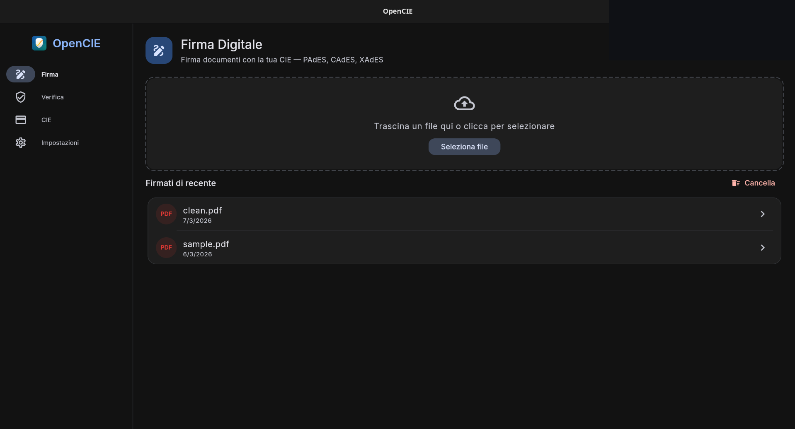
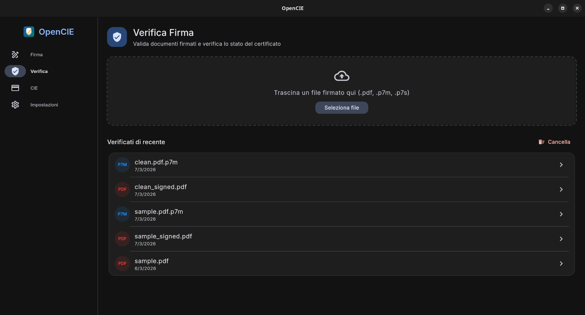
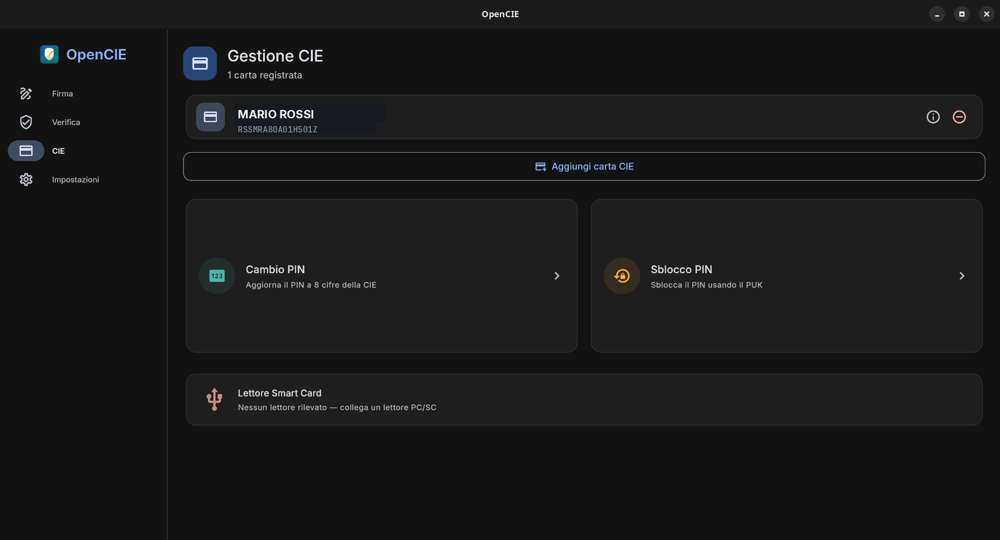
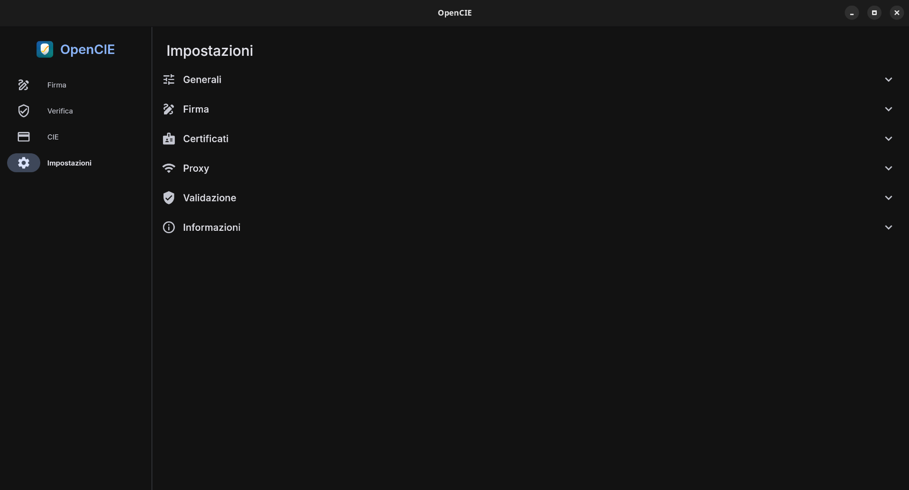

<p align="center">
  
</p>

<h1 align="center">OpenCIE</h1>

<p align="center">
  Open-source application for digital signatures, verification, and identity management with the Italian Electronic Identity Card (CIE — Carta d'Identità Elettronica)
</p>

<p align="center">
  <a href="https://github.com/M0Rf30/opencie/actions"></a>
  
  <a href="LICENSE.md"></a>
</p>

---

<p align="center">
  
  
</p>
<p align="center">
  
  
</p>

## Features

- **Sign** — CAdES (`.p7m`), PAdES (PDF), and XAdES (`.xml`) digital signatures using the CIE chip
- **Verify** — Validate signatures with OCSP/CRL revocation checking
- **Timestamp** — RFC 3161 trusted timestamps; upgrade signatures for long-term validation (B-LT/B-LTA)
- **Manage** — Enroll and manage CIE cards, change/unblock PIN
- **Cross-platform** — Android, Linux, macOS, Windows

Application bundle ID: `io.github.m0rf30.opencie`. iOS is not supported.

## Getting Started

### Prerequisites

- **Flutter SDK** — Dart `^3.11.1` (see [`pubspec.yaml`](pubspec.yaml))
- **Hardware to read the CIE:**
  - Android: device with NFC
  - Desktop (Linux/macOS/Windows): a PC/SC-compatible smart card or contactless reader
- **Native PKCS#11 library** — [`opencie-pkcs11`](https://github.com/M0Rf30/opencie-pkcs11). Build it per the instructions in that repository, then let the OpenCIE build pick it up:
  - **Linux**: place `libopencie-pkcs11.so` in the repo root, set the `OPENCIE_PKCS11_LIB` environment variable to its path, or keep an `opencie-pkcs11` checkout (with `builddir/`) next to this repository — it gets bundled into `bundle/lib/` automatically
  - **Windows**: same, via `OPENCIE_PKCS11_LIB` pointing to the `.dll`
  - **Android**: synced into `android/app/src/main/jniLibs/` (see `scripts/sync-jnilibs.sh`)
  - **macOS**: bundled into the `.app` by CI; for local runs make the `.dylib` findable by `DynamicLibrary.open`
- **For Android builds only:** Android NDK r29, minimum SDK **24** (required by `libopencie-pkcs11`)

### Build

```bash
flutter pub get

flutter build apk --release      # Android
flutter build linux --release    # Linux
flutter build macos --release    # macOS
flutter build windows --release  # Windows
```

### Flatpak (Linux)

```bash
./tools/flatpak-build.sh                  # builds + installs into the user installation
flatpak run io.github.m0rf30.opencie
```

The manifest lives in [`flatpak/`](flatpak/) (Freedesktop 24.08 runtime; grants
network, PC/SC smart card access, and home filesystem access). The host needs
`pcscd` running for card operations: `systemctl enable --now pcscd.socket`.
Flathub publication is planned — the manifest comments document the
from-source module changes the submission requires.

### Run (development)

```bash
flutter run -d <device-id>       # use `flutter devices` to list
```

### Android release signing

`flutter build apk --release` and `flutter build appbundle --release` will use a release keystore when one is configured, and fall back to debug signing otherwise (so `flutter run --release` keeps working out of the box).

**Local builds** — drop a keystore on disk and create `android/key.properties`:

```bash
keytool -genkey -v -keystore opencie.keystore -alias opencie \
  -keyalg RSA -keysize 4096 -validity 10000
```

```properties
# android/key.properties (gitignored)
storeFile=/absolute/path/to/opencie.keystore
storePassword=...
keyAlias=opencie
keyPassword=...
```

**CI (GitHub Actions)** — add four repository secrets under *Settings → Secrets and variables → Actions*:

| Secret | Value |
|---|---|
| `KEYSTORE_BASE64` | `base64 -w0 opencie.keystore` |
| `KEYSTORE_PASSWORD` | keystore password |
| `KEY_ALIAS` | key alias (e.g. `opencie`) |
| `KEY_PASSWORD` | key password |

Without `KEYSTORE_BASE64` the workflow continues with a warning and produces a debug-signed APK/AAB — useful for PR builds, not for distribution. Keep the keystore and passwords offline; losing them means you can't ship updates that Android will accept as the same app.

## Usage

1. Launch OpenCIE.
2. Choose **Sign**, **Verify**, **Timestamp**, or **Manage**.
3. When prompted, present your CIE to the reader (tap on NFC, or insert into a smart card reader) and enter your PIN.
4. For signatures, pick the file to sign and the desired format (CAdES / PAdES / XAdES). The signed output is written next to the original.

## macOS notes

<details>
<summary><strong>Gatekeeper will block the first launch — click to expand</strong></summary>

The macOS DMG produced by CI is **ad-hoc signed only** (`codesign --sign -`). This is free, requires no Apple Developer account, and is just enough for the dynamic linker to load the bundled Homebrew dylibs on Apple Silicon — but it is **not signed with an Apple Developer ID** and is **not notarized**.

As a consequence, on first launch macOS Gatekeeper will refuse to open the app with a message like *"OpenCIE.app is damaged and can't be opened"* or *"cannot be opened because the developer cannot be verified"*. To bypass this:

- **Right-click** the app → **Open** → confirm in the dialog. macOS will remember your choice from then on.
- Or, from a terminal: `xattr -dr com.apple.quarantine /Applications/OpenCIE.app`

This is a deliberate choice. Apple's Developer ID program costs $99/year and requires submitting builds to Apple's notary service — neither is something this project intends to depend on. If you'd prefer a cleanly signed build, you're welcome to fork and add your own signing identity to the workflow.

</details>

## Contributing

Issues and pull requests are welcome — see the [issue tracker](https://github.com/M0Rf30/opencie/issues). For non-trivial changes, please open an issue first to discuss the approach.

## License

Copyright (C) 2026 Gianluca Boiano — [GPL-2.0-or-later](LICENSE.md)
