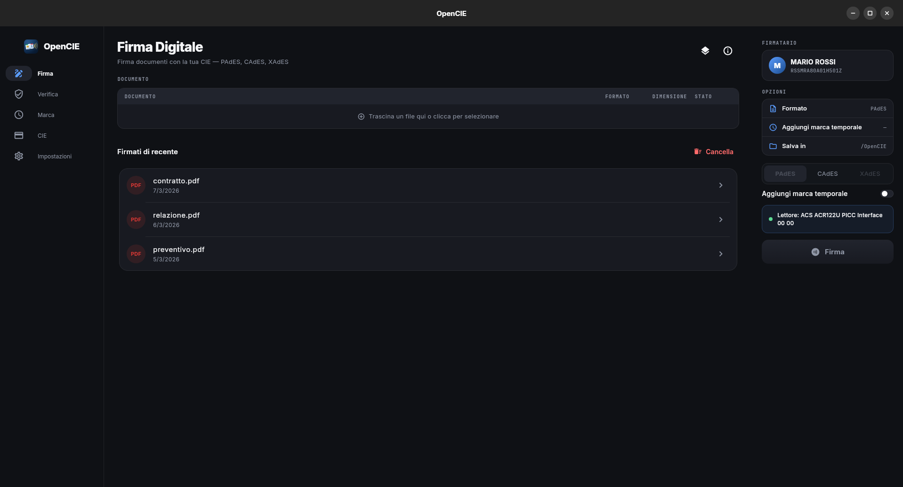
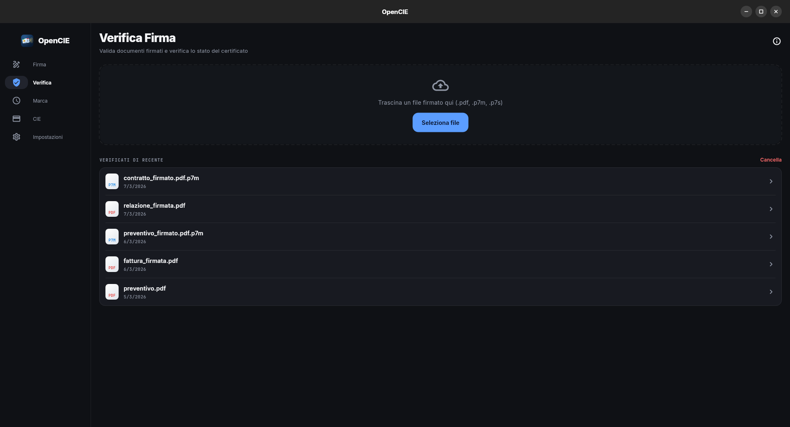
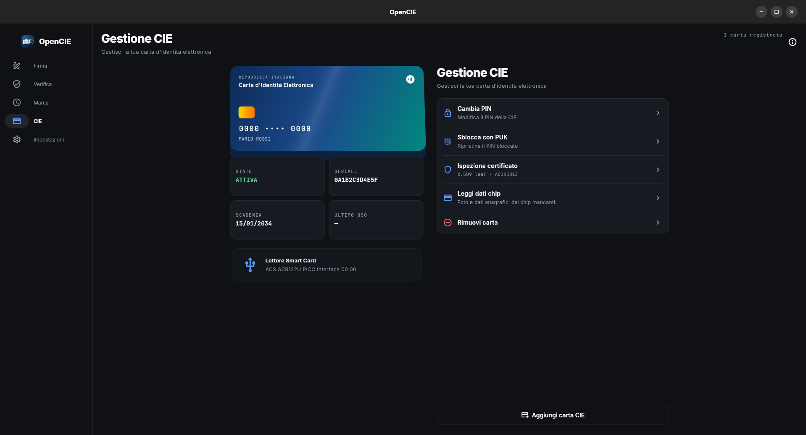
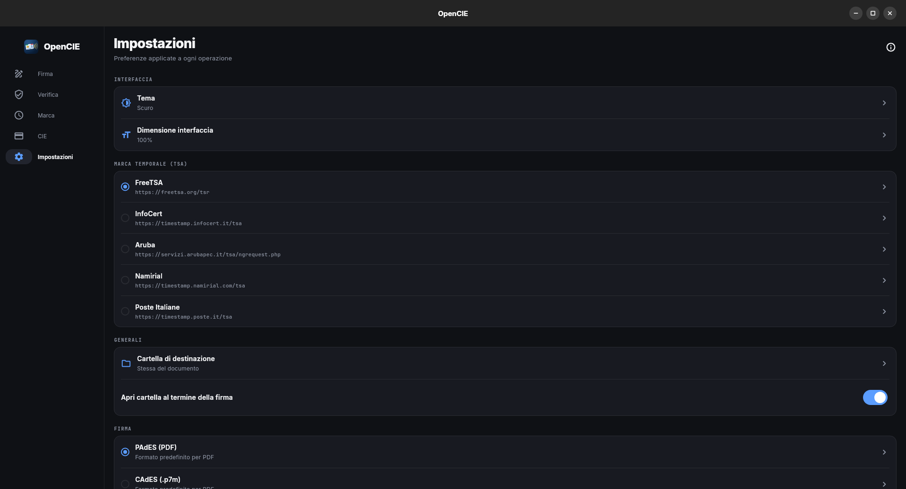

<p align="center">
  
</p>

<h1 align="center">OpenCIE</h1>

<p align="center">
  Open-source application for digital signatures, verification, and identity management with the Italian Electronic Identity Card (CIE — Carta d'Identità Elettronica)
</p>

<p align="center">
  <a href="https://github.com/M0Rf30/opencie/actions"></a>
  <a href="https://github.com/M0Rf30/opencie/releases/latest"></a>
  <a href="https://github.com/M0Rf30/opencie/releases"></a>
  
  <a href="LICENSE.md"></a>
</p>

<p align="center">
  <a href="#features">Features</a> ·
  <a href="#install">Install</a> ·
  <a href="#supported-cards--readers">Supported cards</a> ·
  <a href="#getting-started">Build</a> ·
  <a href="#usage">Usage</a>
</p>

---

<p align="center">
  
  
</p>
<p align="center">
  
  
</p>
<p align="center">
  <sub>Sign · Verify · Manage cards · Settings</sub>
</p>

## Features

| | |
|---|---|
| **Sign** | CAdES (`.p7m`), PAdES (PDF), and XAdES (`.xml`) digital signatures using the CIE chip |
| **Verify** | Validate signatures with OCSP/CRL revocation checking |
| **Timestamp** | RFC 3161 trusted timestamps; upgrade signatures for long-term validation (B-LT/B-LTA) |
| **Manage** | Enroll and manage CIE cards, change/unblock PIN |
| **Cross-platform** | Android, Linux, macOS, Windows |

Application bundle ID: `io.github.m0rf30.opencie`. iOS is not supported.

## Install

### Downloads

Grab the file for your platform from the [latest release](https://github.com/M0Rf30/opencie/releases/latest):

| Platform | File | Notes |
|---|---|---|
| Linux (Flatpak, x86_64) | `opencie-<version>-x86_64.flatpak` | Sandboxed; see [Linux (Flatpak)](#linux-flatpak) |
| Linux (Flatpak, arm64) | `opencie-<version>-aarch64.flatpak` | 64-bit ARM |
| Linux (tarball) | `opencie-<version>-linux-{x86_64,aarch64}.tar.gz` | Pick the one matching your architecture |
| Android | `opencie-<version>-android-arm64-v8a.apk` | An `x86_64` APK is also published for x86_64 devices/emulators |
| Windows | `opencie-<version>-windows-x86_64-setup.exe` | Installer |
| macOS | `opencie-<version>-macos-arm64.dmg` | Apple Silicon; see [macOS notes](#macos-notes) |

### Linux (Flatpak)

Download `opencie-<version>-x86_64.flatpak` (or `opencie-<version>-aarch64.flatpak` on 64-bit ARM) from the [latest release](https://github.com/M0Rf30/opencie/releases/latest) and install it:

```bash
flatpak install --user opencie-<version>-x86_64.flatpak
flatpak run io.github.m0rf30.opencie
```

The bundle is sandboxed (Wayland/X11, network, PC/SC reader, and the XDG
Documents/Downloads/Desktop folders) and pulls the Freedesktop Platform 25.08
runtime from Flathub automatically on first install. Card operations need
`pcscd` running on the host:

```bash
sudo systemctl enable --now pcscd.socket
```

### Android

Install and auto-update via [Obtainium](https://github.com/ImranR98/Obtainium):

<a href="https://apps.obtainium.imranr.dev/redirect?r=obtainium://add/https://github.com/M0Rf30/opencie"></a>

or add it manually in Obtainium using the source URL `https://github.com/M0Rf30/opencie`
(`obtainium://add/https://github.com/M0Rf30/opencie`).

Obtainium tracks the per-ABI APK named `opencie-<version>-android-arm64-v8a.apk` on the
[releases page](https://github.com/M0Rf30/opencie/releases); an `x86_64` build is published
alongside it for x86_64 devices/emulators. There is no `armeabi-v7a` build — `libopencie-pkcs11`
doesn't ship one. Release APKs are signed with the project's release key (see
[Android release signing](#android-release-signing)); tag builds without a configured release
key fail CI instead of shipping a debug-signed APK.

### macOS / Windows

Download the `.dmg` or installer from the [releases page](https://github.com/M0Rf30/opencie/releases).

## Supported cards & readers

OpenCIE supports the CIE 3.0 (contactless and contact). CIE 2.0/older contact cards, health cards (TS/CNS) and other eIDs are not supported. Any PC/SC reader with a contactless or contact slot works; combo readers expose several slots and all are tried, so you don't need to disable built-in readers.

If you see an "unsupported card" error, run `pcsc_scan` to get the card's ATR and open an [issue](https://github.com/M0Rf30/opencie/issues) attaching it together with the log from `~/.CIEPKI/` (Flatpak: `~/.var/app/io.github.m0rf30.opencie/.CIEPKI/`).

Full list of recognised chips and details: [supported-cards.md](https://github.com/M0Rf30/opencie-pkcs11/blob/main/docs/supported-cards.md).

## Getting Started

Building from source is only needed for development or unsupported platforms.

### Prerequisites

- **Flutter SDK** — Dart `^3.11.1` (see [`pubspec.yaml`](pubspec.yaml))
- **Hardware to read the CIE:**
  - Android: device with NFC
  - Desktop (Linux/macOS/Windows): a PC/SC-compatible smart card or contactless reader
- **Native PKCS#11 library** — [`opencie-pkcs11`](https://github.com/M0Rf30/opencie-pkcs11). Build it per the instructions in that repository, then let the OpenCIE build pick it up:
  - **Linux**: place `libopencie-pkcs11.so` in the repo root, set the `OPENCIE_PKCS11_LIB` environment variable to its path, or keep an `opencie-pkcs11` checkout (with `builddir/`) next to this repository — it gets bundled into `bundle/lib/` automatically
  - **Windows**: same, via `OPENCIE_PKCS11_LIB` pointing to the `.dll`
  - **Android**: synced into `android/app/src/main/jniLibs/` (see `scripts/sync-jnilibs.sh`)
  - **macOS**: bundled into the `.app` by CI; for local runs make the `.dylib` findable by `DynamicLibrary.open`
- **For Android builds only:** Android NDK r29, minimum SDK **24** (required by `libopencie-pkcs11`)

### Build

```bash
flutter pub get

flutter build apk --release      # Android
flutter build linux --release    # Linux
flutter build macos --release    # macOS
flutter build windows --release  # Windows
```

### Flatpak (Linux)

<details>
<summary>Build the Flatpak locally</summary>

Build and install into the user installation:

```bash
./tools/flatpak-build.sh
flatpak run io.github.m0rf30.opencie
```

Manifests live in [`flatpak/`](flatpak/) (Freedesktop Platform 25.08 runtime;
grants Wayland/X11, network, PC/SC, and scoped XDG Documents/Downloads/Desktop
access — no blanket home access). Card operations need `pcscd` on the host
(`systemctl enable --now pcscd.socket`). To produce a distributable
single-file bundle:

```bash
flatpak-builder --user --force-clean --repo=repo build \
  flatpak/flathub/io.github.m0rf30.opencie.yml
flatpak build-bundle --runtime-repo=https://flathub.org/repo/flathub.flatpakrepo \
  repo opencie-x86_64.flatpak io.github.m0rf30.opencie
```

</details>

### Run (development)

```bash
flutter run -d <device-id>       # use `flutter devices` to list
```

### Android release signing

<details>
<summary>Keystore setup for local and CI builds</summary>

`flutter build apk --release` and `flutter build appbundle --release` will use a release keystore when one is configured, and fall back to debug signing otherwise (so `flutter run --release` keeps working out of the box).

**Local builds** — drop a keystore on disk and create `android/key.properties`:

```bash
keytool -genkey -v -keystore opencie.keystore -alias opencie \
  -keyalg RSA -keysize 4096 -validity 10000
```

```properties
# android/key.properties (gitignored)
storeFile=/absolute/path/to/opencie.keystore
storePassword=...
keyAlias=opencie
keyPassword=...
```

**CI (GitHub Actions)** — add four repository secrets under *Settings → Secrets and variables → Actions*:

| Secret | Value |
|---|---|
| `KEYSTORE_BASE64` | `base64 -w0 opencie.keystore` |
| `KEYSTORE_PASSWORD` | keystore password |
| `KEY_ALIAS` | key alias (e.g. `opencie`) |
| `KEY_PASSWORD` | key password |

Without `KEYSTORE_BASE64`, PR/branch builds continue with a warning and produce a debug-signed APK/AAB (useful for local testing). Tag builds (`refs/tags/v*`) instead **fail CI** if the release keystore secrets aren't configured — the workflow never publishes a debug-signed release, and also verifies (via `apksigner verify --print-certs`) that the built APKs aren't signed with the Android Debug certificate before staging them. Keep the keystore and passwords offline; losing them means you can't ship updates that Android will accept as the same app.

</details>

## Usage

1. Launch OpenCIE.
2. Choose **Sign**, **Verify**, **Timestamp**, or **Manage**.
3. When prompted, present your CIE to the reader (tap on NFC, or insert into a smart card reader) and enter your PIN.
4. For signatures, pick the file to sign and the desired format (CAdES / PAdES / XAdES). The signed output is written next to the original.

## macOS notes

<details>
<summary><strong>Gatekeeper will block the first launch — click to expand</strong></summary>

The macOS DMG produced by CI is **ad-hoc signed only** (`codesign --sign -`). This is free, requires no Apple Developer account, and is just enough for the dynamic linker to load the bundled Homebrew dylibs on Apple Silicon — but it is **not signed with an Apple Developer ID** and is **not notarized**.

As a consequence, on first launch macOS Gatekeeper will refuse to open the app with a message like *"OpenCIE.app is damaged and can't be opened"* or *"cannot be opened because the developer cannot be verified"*. To bypass this:

- **Right-click** the app → **Open** → confirm in the dialog. macOS will remember your choice from then on.
- Or, from a terminal: `xattr -dr com.apple.quarantine /Applications/OpenCIE.app`

This is a deliberate choice. Apple's Developer ID program costs $99/year and requires submitting builds to Apple's notary service — neither is something this project intends to depend on. If you'd prefer a cleanly signed build, you're welcome to fork and add your own signing identity to the workflow.

</details>

## Contributing

Issues and pull requests are welcome — see the [issue tracker](https://github.com/M0Rf30/opencie/issues). For non-trivial changes, please open an issue first to discuss the approach.

## License

Copyright (C) 2026 Gianluca Boiano — [GPL-3.0-or-later](LICENSE.md)
